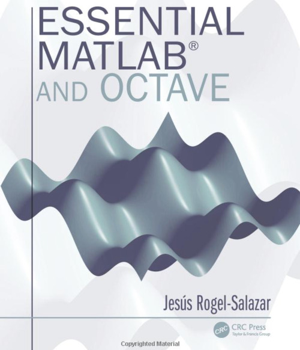

# Essential Matlab and Octave - Code

This respository contains the latest example code and source code for the book [Essential Matlab and Octave](http://bit.ly/EssentialMatlabOctaveBook ) (1st Edition). This code is available for you to play with, learn, fork and expand independently of your interest in the book. Nonetheless, if you find the code being of interest to you, I am sure you will benefit from getting a *non-pirated* copy of the book.

# Marketing Description

[Essential Matlab and Octave](http://bit.ly/EssentialMatlabOctaveBook )

Learn Two Popular Programming Languages in a Single Volume

Widely used by scientists and engineers, well-established MATLAB® and open-source Octave are similar software programs providing excellent capabilities for data analysis, visualization, and more. By means of straightforward explanations and examples from different areas in mathematics, engineering, finance, and physics, Essential MATLAB and Octave explains how MATLAB and Octave are powerful tools applicable to a variety of problems. This text provides an introduction that reveals basic structures and syntax, demonstrates the use of functions and procedures, outlines availability in various platforms, and highlights the most important elements for both programs.

Effectively Implement Models and Prototypes Using Computational Models

This text requires no prior knowledge. Self-contained, it allows the reader to use the material whenever needed rather than follow a particular order. Compatible with both languages, the book material incorporates commands and structures that allow the reader to gain a greater awareness of MATLAB and Octave, write their own code, and implement their scripts and programs within a variety of applicable fields. It is always made clear when particular examples apply only to MATLAB or only to Octave, allowing the book to be used flexibly depending on readers’ requirements.

- Includes brief, simple code that works in both MATLAB and Octave
- Provides exercise sections at the end of each chapter
- Introduces framed examples and discussions with a scientific twist
- Exercises are provided at the end of each chapter

Essential MATLAB and Octave offers an introductory course in MATLAB and Octave programming and is an authoritative resource for students in physics, mathematics, statistics, engineering, and any other subjects that require the use of computers to solve numerical problems.

# Praise

> "This is an excellent book for anyone approaching MATLAB or Octave for the first time. The pleasant language used throughout creates the sensation of having the author by your side... It is very attractive to students to be able to quickly produce plots with scientific journal quality. The margin notes are great as they can also work as virtual bookmarks when required to come back to the explanation of a MATLAB or Octave command." 

-- *Prof Sabino Chávez-Cerda, INAOE, México, OSA Fellow*

> "This well-written book is a must-have for those people starting to solve numerical problems in MATLAB or Octave... Page by page you will find clear explanations describing the way you should use each programming language. The set of homework problems given at the end of each chapter makes the book even more dynamic." 

-- *Hiram Luna-Munguia, PhD, Research Assistant, Department of Neurology, University of Michigan*

> "Essential MATLAB and Octave is a superb introductory textbook for those interested in learning how to solve scientific, engineering, and mathematical problems using two of the most popular mathematical programming tools available. 
>
> Dr. Rogel-Salazar has put a huge amount of effort into making the book accessible and user-friendly in a way that makes it suitable even for the most novice of programmers. The layout of the book is used very effectively with boxes that give clear and concise example programs as well as side notes... This helps the textbook fill a useful gap in the market and make it an excellent companion to introductory courses on scientific computation in degree programs, as well as an accessible but concise guide to anyone learning how to use such tools by themselves." 

-- *Dr. Shashank Virmani, Brunel University London*

> "The text provides a clear and easy paced introduction to MATLAB and Octave. The presentation is example led and contains plenty of useful applications drawn from mathematics, physics, and engineering. This beginner’s handbook will suit a broad scientific readership. A suitable text for a short course or a useful reference for self-study"

-- *Dr. Alan McCall, University of Hertfordshire*

> "Simply, this is an ideal textbook for those who wish to learn elements of scientific pro- gramming but hesitate to make the first step. The textbook under review skilfully leads the reader from elementary topics to more advanced applications... (it) targets readers who need or wish to enter the realm of scientific computing and look for help. By reading the book, they will find themselves on a tour starting from elementary high school mathematics and, due to the author’s teaching skill, almost effortlessly ending in the world of differential equations." 

-- *Jan Chleboun, Czech Technical University, Prague*.

-j